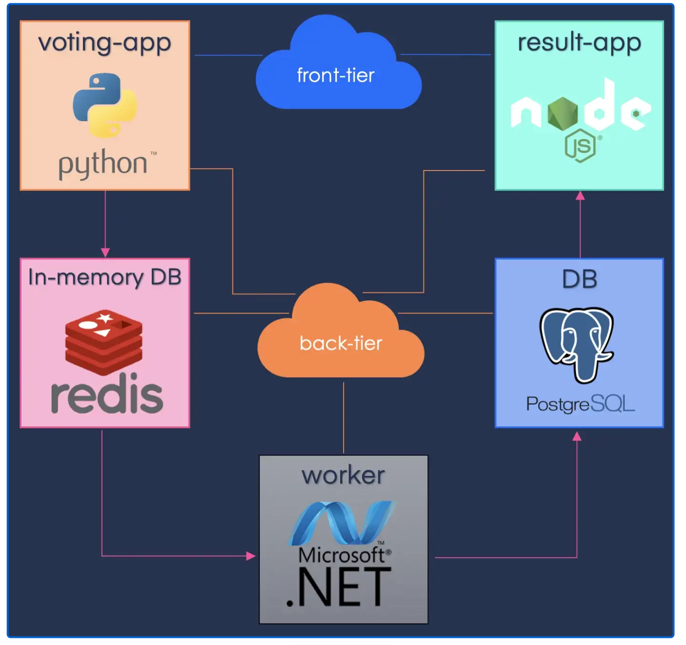

Simple Voting App
=========

A simple multi-tier voting application running on a Linux VM (Ubuntu) managed by Vagrant.  

Tools used
--------------- 

| Category | Tools |  
| :----: | :----: |  
| Virtulization | VirtualBos |  
| Automation | Vagrant |  
| Operating System | Linux (Ubuntu 20.04) |  
| Web Server | Apache HTTP Server |  
| Ochestrator | Docker-compose |  


Getting started
---------------  

## Downloads:

  

## Create and start an Ubuntu Linux VM with Vagrant  

**Open your terminal (e.g. a Mac Terminal or Windows Command Prompt). Create a new directory and cd into it:**    
```
makdir banque_test
cd banque_test
```  
**Use the vagrant init command to initialise a new vagrant machine.** 
```
vagrant init ubuntu/jammy64  
```
**Boot up the virtual machine with:**  
```
vagrant up
```
**Go inside the VM with this command:**
```
vagrant up  
```  

## Install the web server (Apache)  

**Install Apache using the following commands:**
```
sudo apt update 
sudo apt install apache2  
```  
**Check if Apache is running**
```  
systemctl status apache2  
```  

## Setup network to isolate the traffic of the client-facing applications from the backend applications  

**Find the file banque_test/Vagrantfile:**  
```
cd banque_test
sudo vim Vagrantfile
```
**Add this line to set the network configuration to static IP and save:**  
```
config.vm.network "private_network", ip: "192.168.33.10"  
```  

**Reload and SSH into VM:**
```
vagrant reload
vagrant ssh
```  

**Install dependencies:**
```
sudo apt install docker.io
```  
**Add current user to docker group:**
```  
sudo usermod -aG docker $(whoami)
```  
**Start docker:**
```  
systemctl start docker
```  

## Cd into the default Ubuntu document root (/var/www/html) and add application files

**Run the following commands to add files and spin up the app:**
```  
cd /var/www/html
git clone https://github.com/Chidi1/example-voting-app.git
cd example-voting-app
docker-compose up -d
```  

## Test the application  

**Visit the following URLs:**
```  
The app will be running at http://192.168.33.10:5000/ 
The results will be at http://192.168.33.10:5001/ 
```  

## Automate VM and application deployment (To automatically install Apache HTTP Server whenever the virtual machine is created): 

**Locate Vagrantfile**
```
cd /vagrant
sudo vim Vagrantfile
```  
**Edit Vagrantfile and add the following command:**  
```  
config.vm.provision "shell", inline: <<-END
apt update
apt install -y apache2
echo "Machine provisioned at $(date)! Welcome!"
END
``` 


Architecture
-----



* A front-end web app in [Python](/vote) or [ASP.NET Core](/vote/dotnet) which lets you vote between two options
* A [Redis](https://hub.docker.com/_/redis/) or [NATS](https://hub.docker.com/_/nats/) queue which collects new votes
* A [.NET Core](/worker/src/Worker), [Java](/worker/src/main) or [.NET Core 2.1](/worker/dotnet) worker which consumes votes and stores them in…
* A [Postgres](https://hub.docker.com/_/postgres/) or [TiDB](https://hub.docker.com/r/dockersamples/tidb/tags/) database backed by a Docker volume
* A [Node.js](/result) or [ASP.NET Core SignalR](/result/dotnet) webapp which shows the results of the voting in real time


## Additional Tips
-----

**Infrastructure automation using Ansible:**  

Infrastructure automation using Ansible makes it easy to create, execute, and manage automation of infrastructure.  
It's an automation engine that automates cloud provisioning, configuration management, application deployment and intra-service orchestration.  

## Ansible concept:  

**Ansible tasks:** actions that Ansible will execute.  

**Ansible inventory:** The “inventory” is a configuration file where you define the host information. It's a list of hosts where Ansible will execute tasks.  

**Ansible play:** a mapping between groups of hosts in the inventory and tasks to perform.  

**Ansible playbook:** a file with all the plays that Ansible will execute over the inventory. It’s the definition of the state you want the system to have.  

## Ansible components  

**Playbooks:** A playbook is where you define how to apply policies, declare configurations, orchestrate steps and launch tasks either synchronously or asynchronously on your servers.  

**Plays:** Playbooks contain plays. Plays are essentially groups of tasks that are performed on defined hosts to enforce your defined functions.  

**Tasks:** Tasks are actions carried out by playbooks.  

**Roles:** A role is the Ansible way of bundling automation content and making it reusable. Roles are organizational components that can be assigned to a set of hosts to organize tasks.  

**Handlers:** Handlers are similar to tasks except that a handler will be executed only when it is called by an event.  

**Templates:** Templates files are based on Python’s Jinja2 template engine and have a .j2 extension. Contents of index.html file are placed into a template file (optional).  

**Variables:** Used to add custom-made variables in your playbooks.   


